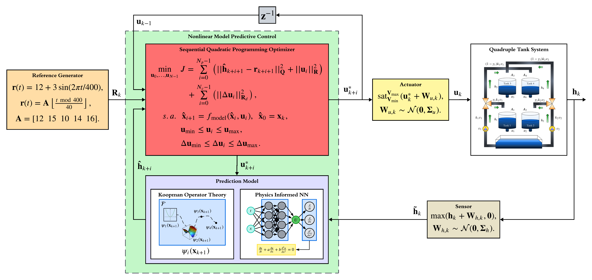

# Data-Driven Identification and MPC of Coupled Tank System using Bilinear Koopman Realizations and Physics-Informed Neural Networks

This repository contains the source code, trained models, notebooks, and simulation results associated with the paper:

> **Data-Driven Identification and MPC of Coupled Tank System using Bilinear Koopman Realizations and Physics-Informed Neural Networks**
>
> Amir Vanegas, Julio Barón-Velandia, Nelson Leonardo Díaz-Aldana, and Duvan Tellez-Castro.
>
> Presented at the **12th International Conference on Control, Decision and Information Technologies (CoDIT 2026)**.

---

## Abstract

Real-time control of multivariable nonlinear processes requires models balancing high fidelity with computational tractability. This paper compares two data-driven paradigms: Bilinear Koopman Realizations and Physics-Informed Neural Networks. While standard Koopman approaches seek global linearization, we leverage a bilinear framework in the lifted functional space to preserve the natural coupling of control-affine systems. Simultaneously, PINNs ensure physical consistency by embedding conservation laws into the learning objective.

To facilitate high-performance control, both surrogate models are integrated into a nonlinear model predictive control scheme using the CasADi framework, enabling efficient algorithmic differentiation for optimization. Simulation results for a quadruple tank system demonstrate that both paradigms reach mean VAF values above 99%, but the Bilinear Koopman model delivers a lower mean RMSE during step transients while doubling the computational speed of the PINN with a Real-Time Factor above 22.

We conclude that despite structural scaling limitations regarding neural exploding gradients and operator instability risks, the Bilinear Koopman realization provides a more reliable, noise-resilient solution for real-time hydraulic benchmarks.

---

## Overview

This work investigates two modern data-driven system identification paradigms for nonlinear predictive control:

- **Physics-Informed Neural Networks (PINNs)**, which incorporate physical laws directly into the training process.
- **Bilinear Koopman Realizations**, which exploit operator-theoretic representations to obtain control-oriented lifted models.

Both approaches are evaluated on the classical **Quadruple Tank System**, a nonlinear and strongly coupled MIMO benchmark widely used in process control research.

Hyperparameters for both the Bilinear Koopman and PINN models were selected using the Optuna optimization framework.

The identified models are embedded within a **Nonlinear Model Predictive Control (NMPC)** framework implemented with **CasADi**, allowing a rigorous comparison in terms of:

- Identification accuracy
- Closed-loop tracking performance
- Robustness under stochastic disturbances
- Real-time computational feasibility

---

## NMPC Architecture

The following figure illustrates the Nonlinear Model Predictive Controller employed throughout this work.

<p align="center">
  
</p>

---

## Reproducibility Notice

### Stochastic Simulation Seeds

All stochastic control experiments reported in this repository were executed using the following random seeds:

```text
1, 2, 3, 4, 5, 6, 7, 8, 9, 10
```

These seeds were used to generate the multiple simulation batches employed for the statistical analysis of the NMPC controllers.

---

## Repository Setup

The experiments reported in this paper were developed and validated using **Poetry** for dependency management. To ensure full reproducibility, it is strongly recommended to use the provided `pyproject.toml` and `poetry.lock` files instead of manually installing packages.

### Clone the Repository

```bash
git clone https://github.com/azvcud/CoDiT_Comparison-of-PINN-and-Bilinear-Koopman.git
cd CoDiT_Comparison-of-PINN-and-Bilinear-Koopman
```

### Install Poetry

Follow the official installation instructions:

https://python-poetry.org/docs/

Verify the installation:

```bash
poetry --version
```

### Install Dependencies

Create the virtual environment and install all required packages:

```bash
poetry install
```

### Activate the Environment

```bash
poetry shell
```

### Launch Jupyter

```bash
jupyter notebook
```

or

```bash
jupyter lab
```

---

## Environment Specifications

The repository was developed using:

- Python >= 3.10, < 3.11
- PyTorch 1.13.1 (CUDA 11.7)
- CasADi 3.7.2
- NumPy 1.26.4
- SciPy 1.11.4
- Pandas 2.0.3
- Scikit-Learn 1.3.2
- Matplotlib 3.7.3
- Seaborn 0.13.2
- SALib 1.5.1
- Optuna 4.9.0
- Scikit-Optimize 0.10.2

All package versions are pinned in the provided Poetry configuration files to guarantee reproducibility of the reported experiments.

---

## Citation

If you use this repository in academic work, please cite:

```bibtex
@inproceedings{vanegas2026codit,
  title={Data-Driven Identification and MPC of Coupled Tank System using Bilinear Koopman Realizations and Physics-Informed Neural Networks},
  author={Vanegas, Amir and Barón-Velandia, Julio and Díaz-Aldana, Nelson Leonardo and Tellez-Castro, Duvan},
  booktitle={International Conference on Control, Decision and Information Technologies (CoDIT)},
  year={2026}
}
```

---

## License

This repository is released under the MIT License.